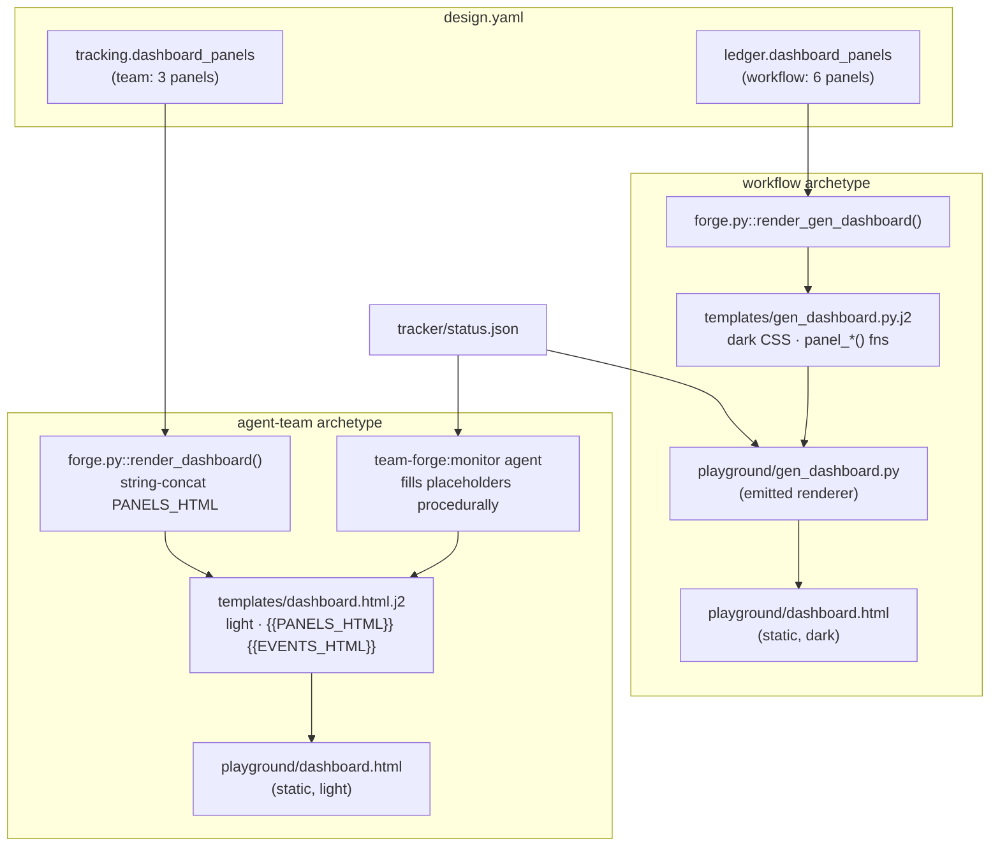
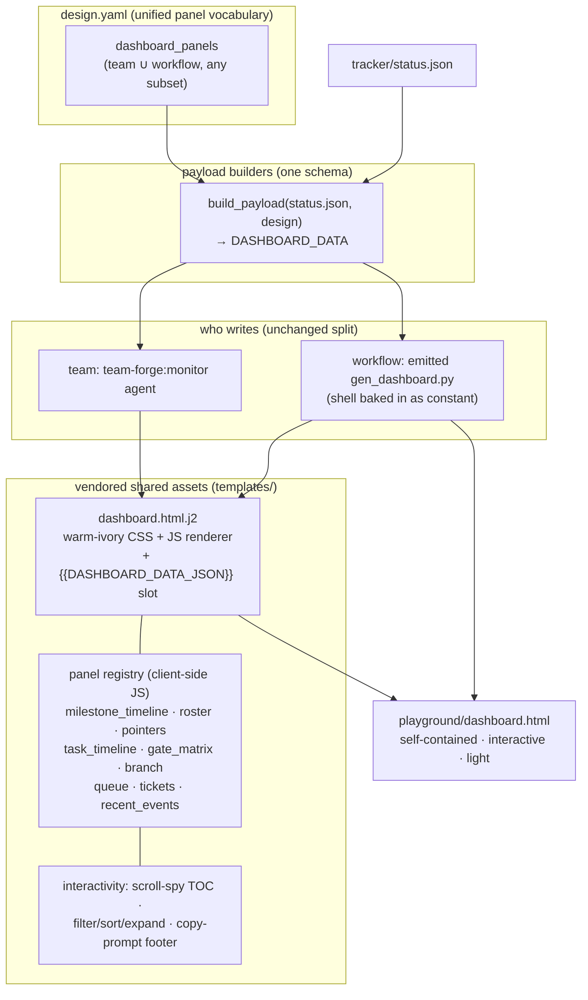

# Spec — Playground → TeamForge dashboard migration

**Status:** DRAFT — awaiting approval
**Date:** 2026-06-23
**Branch:** `feat/playground-dashboard-migration`
**Decisions (locked with user):** interactive + unify archetypes · warm-ivory only · spec-first

## Problem

The dashboard TeamForge forges at bootstrap is a static, non-interactive table, and
it is **inconsistent across the two archetypes**:

| | agent-team | workflow |
|---|---|---|
| Emitter | `forge.py::render_dashboard()` (L136–177) | `forge.py::render_gen_dashboard()` (L254–261) → emits `gen_dashboard.py` |
| Template | `templates/dashboard.html.j2` | `templates/gen_dashboard.py.j2` |
| Runtime writer | `team-forge:monitor` agent (procedural `{{PANELS_HTML}}` fill) | the emitted `gen_dashboard.py` script (no monitor) |
| Theme | warm-ivory **light** | GitHub **dark** |
| Panels | 3 (`milestone_timeline`, `team_roster_and_status`, `current_pointers`) | 6 (`task_timeline`, `gate_matrix`, `integration_branch_status`, `recent_events`, `queue_state`, `ticket_table`) |
| Interactivity | none | none |
| Panel HTML built by | string concat in `render_dashboard` + monitor SKILL.md L105–178 | `panel_*()` fns in `gen_dashboard.py.j2` L27–82 |

Two renderers, two themes, two panel sets, two hand-rolled HTML-string paths — all
static. Meanwhile the repo's own `docs/playgrounds/team-forge-overview.html` already
demonstrates the polished, interactive, single-file pattern (warm-ivory design
system, scroll-spy nav via `IntersectionObserver`, click-to-build copy-prompt
footer) — but none of it reaches the runtime dashboard.

## Goal

The dashboard forged at bootstrap (and every monitor/script rewrite after) is a
**single-file, self-contained, interactive explorer** on the warm-ivory design
system, produced by **one** shared shell + renderer that both archetypes consume.

## Load-bearing decisions (pinned)

1. **Vendor, don't depend.** The `playground` skill lives in `~/.claude/skills/`
   (user-local). A distributed plugin cannot call it. We vendor its design-system +
   interactive patterns into team-forge `templates/` — formalizing what
   `team-forge-overview.html` already hand-copied.
2. **One shell, two consumers.** A single `templates/dashboard.html.j2` carries the
   full CSS + JS renderer + a single `{{DASHBOARD_DATA_JSON}}` slot. The **monitor**
   reads it from the extension at runtime; **forge** bakes it into the emitted
   `gen_dashboard.py` as a string constant (so the workflow runtime script stays
   self-contained, with no dependency on the extension being present).
3. **Embed the payload, don't fetch it.** Dashboards open via `file://`, where
   `fetch()` of a sibling JSON is CORS-blocked. The writer injects the status
   payload **into** the HTML as `const DASHBOARD_DATA = {…}`; the vendored JS renders
   panels client-side. This is the playground self-contained pattern and is what
   makes interactivity possible offline.
4. **Read-only interactivity.** `status.json` stays single-writer. The dashboard
   filters/sorts/expands and copies prompts — it never edits state.
5. **Warm-ivory only.** The workflow dark theme is retired; both archetypes render
   the light editorial theme. (The `:root` block already exists verbatim in
   `dashboard.html.j2` L7–13.)

## Current state



## Target state



The only per-archetype difference that survives: **who runs the payload builder**
(monitor agent vs. emitted script). The shell, CSS, JS renderer, panel registry,
interactivity, theme, and payload schema are all shared.

## Component inventory (what changes)

| File | Change | Notes |
|---|---|---|
| `templates/dashboard.html.j2` | **Rewrite** as self-contained interactive shell | warm-ivory CSS (kept) + vendored JS renderer (new) + panel registry + scroll-spy + copy-prompt footer + single `{{DASHBOARD_DATA_JSON}}` slot. All other `{{VAR}}` reads move into the payload. |
| `templates/gen_dashboard.py.j2` | **Gut + rewrite** | delete `panel_*()` (L27–82) + dark `CSS` (L84–99); becomes `load status.json → build_payload() → SHELL.replace(slot, json) → write`. Shell baked in at forge time. |
| `tools/forge.py::render_dashboard` | **Rewrite** | drop PANELS_HTML/EVENTS_HTML concat (L144–176); build payload dict, inject into shell. |
| `tools/forge.py::render_gen_dashboard` | **Update** | bake the shared shell constant into the emitted script. |
| `skills/monitor/SKILL.md` | **Simplify** | replace Step 3 procedural placeholder-fill (L91–178) with "build payload (Step 2, kept) → inject `{{DASHBOARD_DATA_JSON}}` → atomic write". Payload schema becomes the single contract. |
| `templates/design.yaml.j2` | **Doc** | note the unified panel vocabulary is available to both archetypes (no schema break). |
| `docs/playgrounds/team-forge-overview.html` | **Fix** | stale L343 claim ("why dashboard.html is durable") — retro #1687 made it ephemeral. |
| `tests/` | **Add/Update** | forge end-to-end emits valid self-contained HTML for both archetypes; payload-schema unit check; renderer smoke (no JS errors via a headless check or DOM-string assertions). |
| `.claude-plugin/plugin.json`, `forge.py` version strings | **Bump** | `0.3.0 → 0.4.0`. |

## Unified payload schema (single contract)

```jsonc
{
  "meta": { "team", "project_display_name", "project_basename", "domain",
            "archetype", "overall_status", "current_milestone", "current_cohort_id",
            "current_task", "token_spend_cumulative_k", "last_update_iso" },
  "panels": ["milestone_timeline", "task_timeline", ...],   // order = render order
  "milestones": [{ "id", "name", "output", "status" }],
  "roster":     [{ "name", "role", "status" }],
  "tasks":      [{ "id", "status", "gate_status", "commit" }],
  "gate_results":[{ "task", "gate", "passed" }],
  "tickets":    [{ "issue", "type", "route", "stage", "pr_url" }],
  "queue":      { "eligible", "full_drain", "plan_gate", "in_flight", "pr_ready", "blocked" },
  "integration_branch": { "name", "head_sha", "pr_url" },
  "pointers":   { "brainstorm", "team_plan" },
  "events":     [{ "ts", "actor", "kind", "summary" }]        // last 30
}
```
A panel renders only the slices it needs; absent slices → graceful empty-state. Custom
domain panel ids with no registered renderer → labeled empty-state (today's behavior).

## Interactivity (read-only, client-side)

- **Scroll-spy TOC** down the left rail (the overview.html `IntersectionObserver` pattern).
- **Filter/sort** within table panels (tasks/tickets by status; events by kind).
- **Expand/collapse** panels and long event payloads.
- **Copy-prompt footer**: clicking a panel/row builds a context-aware prompt
  ("ask the lead why task `T3` is blocked") and copies it — the overview.html
  `select()`/`copyPrompt()` pattern, generalized over live data.

## Phases

1. **Vendor + shell.** Rewrite `dashboard.html.j2` into the self-contained shell
   (CSS + JS renderer + panel registry + interactivity + payload slot). Hand-verify
   it renders from a sample payload (open in browser).
2. **Unify builders.** Rewrite `gen_dashboard.py.j2` (workflow) + `render_dashboard`
   (team) to the shared `build_payload` + shell injection. Retire dark theme.
3. **Simplify monitor.** Rewrite monitor SKILL.md Step 3; keep the payload schema.
4. **Docs + tests + bump.** design.yaml.j2 note, overview.html fix, tests, `0.4.0`.

## Risks / open items

- **Self-contained size**: inlining CSS+JS yields a larger HTML, acceptable for a
  local file; no external requests.
- **Renderer must degrade**: unknown/empty panels render labeled empty-state, never
  throw.
- **Live teams unaffected**: already-forged teams keep their baked dashboards; only
  new forges get the new shell. No live migration needed.
- **No-JS fallback**: `file://` with JS disabled shows an empty shell — acceptable
  for a dev dashboard; a `<noscript>` note is added.
- **Out of scope (noted, not fixed here)**: `forge.py` L15 hardcodes
  `EXT_DIR = /Users/shirleyfu/8888/team-forge` — a portability smell; separate fix.

## Non-goals

Editing/writing state from the dashboard; live server/websocket refresh; dark theme;
migrating already-forged teams; changing the tracker/monitor single-writer split.
